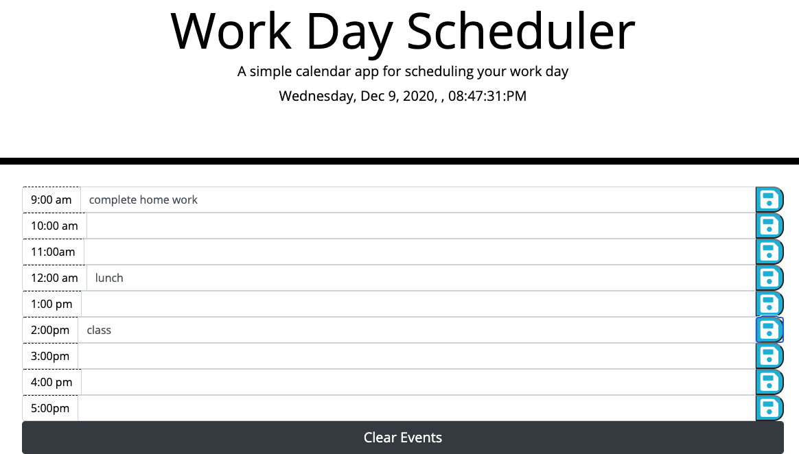

# workday_scheduler
In my appilication I used from bootstrab to my time build block. And I included index.html,script.js, style.css and screenshot images.
under title it shows current day date, year and hours are avilable.
in the time block or the main body you can write down you events or schedules and you can save at the right button by clicking and it saves in local storage.
incase if you want dismiss or change your maind you can click clearevents and asks you confimition for safity.

URL:  https://destish21.github.io/workday_scheduler/